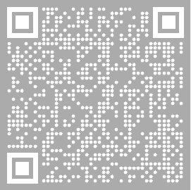

#  Kryptokrona Python SDK [](https://github.com/kryptokrona/kryptokrona-python-sdk/issues) [](https://github.com/kryptokrona/kryptokrona-python-sdk/pulls) [](https://github.com/kryptokrona/kryptokrona-sdk/blob/main/LICENSE)

Kryptokrona Python SDK for building decentralized private communication and payment systems.

# Table of Contents

- [Development resources](#development-resources)
- [Technologies](#technologies)
- [Contribute](#contribute)
  - [Pull Request](#pull-request)
  - [Donate](#donate)
- [Contributors](#contributors)
- [License](#license)

## Development Resources

- Web: kryptokrona.org
- Mail: mjovanc@protonmail.com
- GitHub: https://github.com/kryptokrona
- Hugin: sdkdevs board on Hugin Messenger
- It is HIGHLY recommended to join our board on Hugin Messenger if you want to contribute to stay up to date on what is happening on the project.


# Technologies

- Python 3.9
- asyncio

# Installation

- `git clone git@github.com:kryptokrona/kryptokrona-python-sdk.git`
- `(cd kryptokrona-python-sdk && virtualenv -p python3 .)`
- `source bin/activate`
- `pip install -r requirements.txt`

## Contribute

If you would like to contribute to this project there is two ways:

- Send a pull request
- Donate to XKR address

### Pull request

We appreciate all contributions whether it be small changes such as documentation of source code to major improvement of code.

The easiest way is to make a fork and then make a pull request into our develop branch. To make the PR go through make sure to include this information:

```
What does this PR do?

Why are these changes required?

This PR has been tested using (e.g. Unit Tests, Manual Testing):

Extra details?
```

**NOTE:** Remember to update existing diagrams if there is some bigger improvements of code so it's up to date with the implementation.

### Donate

XKR: SEKReXXU9aJPiwjX2XkpbK8ACMWbUNXcYPxUVSiUYpNdhj8Z2snEy8CjjorZUNyswQNfzAmVWuGksU72Sf3Kq79Zd3fJWHq4Nyx



## Contributors

The following contributors have either helped to start this project, have contributed
code, are actively maintaining it (including documentation), or in other ways
being awesome contributors to this project. **We'd like to take a moment to recognize them.**

[](https://github.com/mjovanc)

## License

The license is GPL-3.0 License.
